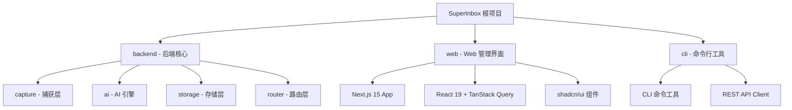
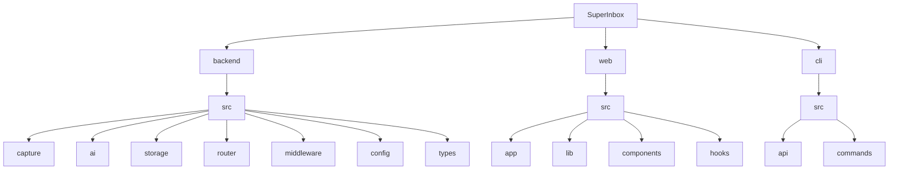

# SuperInbox 项目架构文档

> **最后更新:** 2026-01-16
> **版本:** 0.1.0
> **项目类型:** 全栈 Monorepo (Backend + Web + CLI)

---

## 变更记录

### 2026-01-16
- 初始化项目架构文档
- 完成全库扫描与架构分析
- 记录核心模块与技术栈

---

## 项目愿景

SuperInbox 是一个**数字化信息的统一入口与智能路由系统**，旨在解决现代信息碎片化问题。通过 AI 驱动的意图识别和自动化路由，用户可以快速捕获任意类型的信息（文本、图片、链接、文件），系统将自动分析、分类并分发到最适合的目标平台（Notion、Obsidian、Webhook 等）。

**核心理念：**
- **统一入口**：一个 API 接收所有来源的信息
- **智能解析**：AI 自动识别意图、提取实体
- **灵活路由**：基于规则自动分发到多个目标
- **可扩展性**：适配器模式支持任意第三方平台

---

## 架构总览

SuperInbox 采用**前后端分离**的架构，包含三个核心模块：



### 技术栈总览

| 层级 | 技术选型 | 说明 |
|------|----------|------|
| **后端框架** | Express.js + TypeScript | RESTful API 服务 |
| **数据库** | SQLite (better-sqlite3) | 轻量级本地数据库，支持 WAL 模式 |
| **AI 引擎** | OpenAI/DeepSearch/智谱 | 可配置的 LLM 提供商 |
| **前端框架** | Next.js 15 (App Router) + React 19 | SSR/SSG 混合渲染 |
| **UI 组件** | shadcn/ui + Radix UI | 无样式组件库，完全可定制 |
| **状态管理** | TanStack Query + Zustand | 服务端状态 + 客户端状态 |
| **样式** | Tailwind CSS | 原子化 CSS 框架 |
| **CLI 工具** | Commander + Chalk | Node.js 命令行应用 |
| **构建工具** | TypeScript + tsx | 编译与开发时执行 |

---

## 模块结构图



---

## 模块索引

| 模块 | 路径 | 职责 | 技术栈 | 状态 |
|------|------|------|--------|------|
| **backend** | `/backend` | 后端核心服务 | Express + TypeScript + SQLite | ✅ 核心模块 |
| **web** | `/web` | Web 管理界面 | Next.js 15 + React 19 + shadcn/ui | ✅ 核心模块 |
| **cli** | `/cli` | 命令行工具 | Commander + Axios + Chalk | ✅ 核心模块 |

---

## 运行与开发

### 环境要求

- **Node.js:** >= 18.0.0
- **npm/yarn/pnpm:** 任意包管理器
- **SQLite3:** 自动通过 better-sqlite3 安装

### 快速启动

#### 1. 后端服务

```bash
cd backend

# 安装依赖
npm install

# 配置环境变量
cp .env.example .env
# 编辑 .env 文件，配置 LLM_API_KEY

# 初始化数据库
npm run db:migrate
npm run db:seed

# 启动开发服务器
npm run dev

# 生产构建
npm run build
npm start
```

**默认端口:** 3000
**健康检查:** http://localhost:3000/health

#### 2. Web 界面

```bash
cd web

# 安装依赖
npm install

# 配置环境变量
cp .env.local.example .env.local
# 编辑 .env.local，设置 NEXT_PUBLIC_API_URL

# 启动开发服务器
npm run dev

# 生产构建
npm run build
npm start
```

**默认端口:** 3000 (需与后端分开或配置代理)
**访问地址:** http://localhost:3000

#### 3. CLI 工具

```bash
cd cli

# 安装依赖
npm install

# 配置环境变量
cp .env.example .env
# 编辑 .env，设置 API endpoint 和 API Key

# 开发模式
npm run dev -- list

# 构建
npm run build

# 全局安装（构建后）
npm link
sinbox list
```

### Docker 部署

```bash
cd backend

# 使用 Docker Compose 启动
docker-compose up -d

# 查看日志
docker-compose logs -f

# 停止服务
docker-compose down
```

---

## Backend - 后端核心

### 目录结构

```
backend/
├── src/
│   ├── capture/          # 捕获层 - API 接收端点
│   │   ├── controllers/  # 控制器（业务逻辑）
│   │   ├── routes/       # 路由定义
│   │   └── index.ts
│   ├── ai/               # AI 处理引擎
│   │   ├── service.ts    # AI 服务封装
│   │   ├── llm-client.ts # LLM 客户端
│   │   ├── intent-classifier.ts # 意图分类
│   │   └── index.ts
│   ├── storage/          # 存储层
│   │   ├── database.ts   # 数据库管理
│   │   ├── migrations/   # 数据库迁移
│   │   └── seeds/        # 种子数据
│   ├── router/           # 分发路由层
│   │   ├── router.service.ts # 路由服务
│   │   ├── adapters/     # 适配器实现
│   │   │   ├── notion.adapter.ts
│   │   │   ├── obsidian.adapter.ts
│   │   │   └── webhook.adapter.ts
│   │   ├── adapter.interface.ts # 适配器接口
│   │   └── routes/       # 路由管理 API
│   ├── middleware/       # Express 中间件
│   │   ├── auth.ts       # 认证中间件
│   │   ├── validation.ts # 验证中间件
│   │   ├── error-handler.ts
│   │   ├── logger.ts
│   │   └── index.ts
│   ├── config/           # 配置管理
│   │   └── index.ts      # 环境变量验证与加载
│   ├── types/            # TypeScript 类型定义
│   │   └── index.ts      # 核心类型（Item、Intent、Adapter 等）
│   ├── intelligence/     # 智能分析模块
│   │   └── routes/       # Prompt 管理 API
│   └── index.ts          # 应用入口
├── tests/                # 测试文件
├── dist/                 # 编译输出
├── package.json
├── tsconfig.json
├── Dockerfile
└── docker-compose.yml
```

### 核心 API 端点

#### 收件箱 API

| 方法 | 路径 | 说明 |
|------|------|------|
| POST | `/v1/inbox` | 创建新条目 |
| GET | `/v1/items` | 获取条目列表（支持筛选） |
| GET | `/v1/items/:id` | 获取单个条目详情 |
| PUT | `/v1/items/:id` | 更新条目 |
| DELETE | `/v1/items/:id` | 删除条目 |
| POST | `/v1/items/:id/distribute` | 手动触发分发 |

#### 智能分析 API

| 方法 | 路径 | 说明 |
|------|------|------|
| GET | `/v1/intelligence/parse/:id` | 获取 AI 解析结果 |
| PATCH | `/v1/intelligence/parse/:id` | 修正解析结果 |
| GET | `/v1/intelligence/prompts` | 获取 Prompt 模板 |
| PUT | `/v1/intelligence/prompts/:id` | 更新 Prompt 模板 |

#### 路由管理 API

| 方法 | 路径 | 说明 |
|------|------|------|
| GET | `/v1/routing/rules` | 获取路由规则 |
| POST | `/v1/routing/rules` | 创建路由规则 |
| PUT | `/v1/routing/rules/:id` | 更新路由规则 |
| DELETE | `/v1/routing/rules/:id` | 删除路由规则 |

### 数据模型

#### Item（条目）

```typescript
interface Item {
  id: string;
  userId: string;
  originalContent: string;
  contentType: ContentType;
  source: string;
  intent: IntentType;
  entities: ExtractedEntities;
  summary?: string;
  suggestedTitle?: string;
  status: ItemStatus;
  priority: Priority;
  distributedTargets: string[];
  distributionResults: DistributionResult[];
  createdAt: Date;
  updatedAt: Date;
  processedAt?: Date;
}
```

#### IntentType（意图类型）

```typescript
enum IntentType {
  TODO = 'todo',           // 待办事项
  IDEA = 'idea',           // 想法/灵感
  EXPENSE = 'expense',     // 消费记录
  NOTE = 'note',           // 笔记
  BOOKMARK = 'bookmark',   // 书签/收藏
  SCHEDULE = 'schedule',   // 日程安排
  UNKNOWN = 'unknown'      // 未知类型
}
```

### 适配器接口

所有分发适配器必须实现 `IAdapter` 接口：

```typescript
interface IAdapter {
  readonly type: AdapterType;
  readonly name: string;

  initialize(config: Record<string, unknown>): Promise<void>;
  distribute(item: Item): Promise<DistributionResult>;
  validate(config: Record<string, unknown>): boolean;
  healthCheck(): Promise<boolean>;
}
```

**内置适配器：**
- `NotionAdapter` - 同步到 Notion 数据库
- `ObsidianAdapter` - 创建 Markdown 笔记到本地 vault
- `WebhookAdapter` - 发送 HTTP POST 请求

---

## Web - 前端管理界面

### 目录结构

```
web/
├── src/
│   ├── app/              # Next.js App Router 页面
│   │   ├── page.tsx      # 首页
│   │   ├── inbox/        # 收件箱页面
│   │   ├── settings/     # 设置页面
│   │   └── layout.tsx    # 根布局
│   ├── components/       # React 组件
│   │   ├── ui/           # shadcn/ui 基础组件
│   │   ├── inbox/        # 收件箱相关组件
│   │   └── layout/       # 布局组件
│   ├── lib/              # 工具库
│   │   ├── api/          # API 客户端
│   │   │   ├── client.ts # Axios 封装
│   │   │   ├── inbox.ts  # 收件箱 API
│   │   │   ├── intelligence.ts # 智能 API
│   │   │   ├── routing.ts # 路由 API
│   │   │   └── adapter.ts # 数据适配器
│   │   └── utils.ts      # 工具函数
│   ├── hooks/            # 自定义 Hooks
│   │   └── use-toast.ts  # Toast 通知
│   └── types/            # 类型定义
│       └── index.ts
├── public/               # 静态资源
├── package.json
├── tsconfig.json
├── tailwind.config.ts
└── next.config.js
```

### 技术栈详解

#### 核心依赖

- **Next.js 15** - App Router、React Server Components
- **React 19** - 最新版本，支持并发特性
- **TypeScript** - 类型安全
- **Tailwind CSS** - 原子化样式
- **shadcn/ui** - 基于 Radix UI 的组件库

#### 状态管理

- **@tanstack/react-query** - 服务端状态管理、缓存、重新验证
- **Zustand** - 轻量级客户端状态管理

#### 表单处理

- **react-hook-form** - 高性能表单管理
- **zod** - Schema 验证
- **@hookform/resolvers** - Zod 集成

#### UI 组件

- **@radix-ui/*** - 无样式可访问组件
  - Dialog、Dropdown Menu、Label、Select、Switch、Tabs、Toast
- **cmdk** - Command Menu (Cmd+K)
- **lucide-react** - 图标库
- **date-fns** - 日期处理

### 数据适配层

前端与后端的数据结构通过 **Adapter 模式** 进行转换：

```typescript
// backend/src/types/index.ts (后端)
interface BackendItem {
  id: string;
  user_id: string;
  original_content: string;
  content_type: ContentType;
  // snake_case 命名
}

// web/src/types/index.ts (前端)
interface Item {
  id: string;
  userId: string;
  originalContent: string;
  contentType: ContentType;
  // camelCase 命名
}

// web/src/lib/api/adapter.ts
function adaptBackendItem(backendItem: BackendItem): Item {
  return {
    id: backendItem.id,
    userId: backendItem.user_id,
    originalContent: backendItem.original_content,
    contentType: backendItem.content_type,
    // ... 字段映射
  };
}
```

### API 客户端架构

```typescript
// web/src/lib/api/client.ts
class ApiClient {
  private client: AxiosInstance;

  constructor() {
    this.client = axios.create({
      baseURL: process.env.NEXT_PUBLIC_API_URL || 'http://localhost:3000/v1',
      timeout: 30000,
    });

    // 请求拦截器 - 自动添加 API Key
    this.client.interceptors.request.use((config) => {
      const apiKey = localStorage.getItem('superinbox_api_key');
      config.headers['Authorization'] = `Bearer ${apiKey}`;
      return config;
    });

    // 响应拦截器 - 处理 401 错误
    this.client.interceptors.response.use(
      (response) => response,
      (error) => {
        if (error.response?.status === 401) {
          localStorage.removeItem('superinbox_api_key');
          window.location.href = '/settings';
        }
        return Promise.reject(error);
      }
    );
  }
}
```

### 访问日志与审计

**功能概述：**
SuperInbox 提供完整的 API 访问日志记录和审计功能，帮助管理员追踪和分析所有 API 请求。

**页面路由：**
- `/settings/logs` - 全局访问日志（需要 `admin:full` 权限）
- `/settings/api-keys/[id]/logs` - 单个 API Key 的日志

**功能特性：**
- **多维度筛选**
  - 快速筛选：时间范围（今天/本周/本月/自定义）、状态（成功/失败/拒绝）、关键词搜索
  - 高级筛选：HTTP 方法、IP 地址、API Key
  - 筛选条件同步到 URL，支持分享和书签

- **日志详情查看**
  - 展开式详情行，显示完整请求/响应信息
  - 请求头、请求体、查询参数
  - 响应状态码、响应大小、响应耗时
  - 错误信息（错误码、错误消息、详细堆栈）

- **日志导出**
  - 支持格式：CSV、JSON、XLSX
  - 字段选择：可自定义导出的字段
  - 同步导出：< 1000 条立即下载
  - 异步导出：>= 1000 条后台处理，完成后通知

**技术实现：**
- `TanStack Query` - 数据获取和缓存
- `URLSearchParams` - 筛选器状态管理
- `shadcn/ui` - UI 组件库
- `date-fns` - 日期格式化

**后端实现：**
- **日志记录中间件** ([`middleware/access-logger.ts`](backend/src/middleware/access-logger.ts))
  - 自动记录所有 API 请求
  - 提取 IP、User-Agent、请求/响应大小
  - 计算请求耗时
  - 异步写入数据库（不阻塞响应）

- **数据库表** ([`storage/migrations/run.ts`](backend/src/storage/migrations/run.ts))
  - `api_access_logs` - 增强的访问日志表
  - `export_tasks` - 导出任务表

- **API 端点** ([`auth/logs.controller.ts`](backend/src/auth/logs.controller.ts))
  - `GET /v1/auth/logs` - 查询全局日志
  - `GET /v1/auth/api-keys/:id/logs` - 查询单个 Key 日志
  - `POST /v1/auth/logs/export` - 创建导出任务
  - `GET /v1/auth/logs/exports/:id` - 获取导出状态
  - `GET /v1/auth/logs/exports/:id/download` - 下载导出文件

---

## CLI - 命令行工具

### 目录结构

```
cli/
├── src/
│   ├── api/              # API 客户端
│   │   └── client.ts     # HTTP 封装
│   ├── commands/         # 命令实现
│   │   ├── list.ts       # 列出条目
│   │   ├── show.ts       # 显示详情
│   │   ├── status.ts     # 查看状态
│   │   └── configure.ts  # 配置管理
│   └── cli.ts            # CLI 入口
├── package.json
└── tsconfig.json
```

### 可用命令

```bash
# 全局安装后
sinbox list [options]       # 列出所有条目
sinbox show <id>            # 显示条目详情
sinbox status               # 查看系统状态
sinbox configure            # 配置 API 设置
```

### 技术栈

- **Commander** - 命令行框架
- **Chalk** - 终端颜色
- **Ora** - 加载动画
- **Inquirer** - 交互式提示
- **cli-table3** - 表格展示
- **Axios** - HTTP 请求
- **Conf** - 配置管理

---

## 测试策略

### 后端测试

```bash
cd backend

# 运行测试
npm test

# 测试覆盖率
npm run test:coverage

# 代码检查
npm run lint
```

### 前端测试

```bash
cd web

# 代码检查
npm run lint
```

### CLI 测试

```bash
cd cli

# 运行测试
npm test
```

---

## 编码规范

### 语言要求 (IMPORTANT)

**所有代码和 Git 提交必须使用英文：**

1. **Git Commit Messages** - 必须使用英文
   - ✅ 正确: `feat(cli): add JWT authentication support`
   - ❌ 错误: `feat(cli): 添加 JWT 认证支持`

2. **代码注释** - 必须使用英文
   - ✅ 正确: `// Check if user is logged in`
   - ❌ 错误: `// 检查用户是否已登录`

3. **变量/函数命名** - 必须使用英文
   - ✅ 正确: `getUserById`, `isAuthenticated`
   - ❌ 错误: `huoQuYongHu`, `yiDengLu`

4. **允许使用中文的场景：**
   - 用户界面文本（UI labels, messages, prompts）
   - 面向用户的文档（README 的中文版本）
   - 用户可见的错误消息
   - 日志输出中的描述性文本

### TypeScript 规范

- 使用 **ES Modules** (`"type": "module"`)
- 严格模式开启 (`"strict": true`)
- 使用 ES2017+ 目标
- 优先使用 `const`/`let`，避免 `var`
- 使用箭头函数
- 显式类型注解（函数参数、返回值）
- **所有注释必须使用英文**

### 命名约定

- **文件名:** `kebab-case.ts` (例如: `inbox.controller.ts`)
- **类名:** `PascalCase` (例如: `InboxController`)
- **函数/变量:** `camelCase` (例如: `getItemById`)
- **常量:** `UPPER_SNAKE_CASE` (例如: `API_URL`)
- **接口/类型:** `PascalCase` (例如: `Item`, `CreateItemRequest`)
- **枚举:** `PascalCase` + 值为 `lowercase` (例如: `IntentType.TODO`)

### Git 提交规范

**重要：所有 Git Commit 消息必须使用英文**

遵循 [Conventional Commits](https://www.conventionalcommits.org/)：

```
<type>[optional scope]: <description>

[optional body]

[optional footer(s)]
```

**类型:**
- `feat`: New feature
- `fix`: Bug fix
- `docs`: Documentation updates
- `style`: Code formatting (no functional changes)
- `refactor`: Code refactoring
- `perf`: Performance improvements
- `test`: Test-related changes
- `chore`: Build/toolchain changes

**示例:**
```
feat(inbox): add batch create endpoint

Implement POST /v1/inbox/batch to support creating
multiple items in a single request.

Closes #123
```

**更多示例:**
```
fix(cli): fix logout error when clearing auth config

- Remove undefined value assignment to config
- Add delete() method to ConfigManager
- Use config.delete() to clear auth data

Closes #456
```

---

## AI 使用指引

### 与 Claude 协作的最佳实践

#### 1. 项目上下文

Claude 已了解项目整体架构，可以直接询问模块细节：

```
# 示例问题
- "请解释 inbox.controller.ts 中的 createItem 流程"
- "如何添加一个新的适配器？"
- "前端如何处理后端的 snake_case 响应？"
```

#### 2. 代码生成请求

明确指定路径和技术栈：

```
# 好的请求
"在 backend/src/router/adapters/ 中创建一个新的 todoist.adapter.ts，
参考 notion.adapter.ts 的结构，实现 IAdapter 接口"

# 不好的请求
"创建一个 Todoist 适配器"
```

#### 3. 调试辅助

提供错误信息和上下文：

```
"在调用 POST /v1/inbox 时返回 500 错误：
[粘贴错误日志]
相关的 controller 代码在 backend/src/capture/controllers/inbox.controller.ts"
```

#### 4. 架构决策讨论

Claude 可以帮助评估技术方案：

```
"考虑将 SQLite 迁移到 PostgreSQL，请分析利弊，
并评估对现有 adapter 架构的影响"
```

### 常见任务模式

#### 添加新的 API 端点

1. 在 `backend/src/{module}/routes/` 创建路由文件
2. 在 `backend/src/{module}/controllers/` 创建控制器
3. 在 `backend/src/index.ts` 注册路由
4. 在 `web/src/lib/api/` 添加前端 API 客户端方法
5. 在 `web/src/types/` 更新类型定义

#### 添加新的适配器

1. 在 `backend/src/router/adapters/` 创建 `{name}.adapter.ts`
2. 实现 `IAdapter` 接口
3. 在 `backend/src/router/adapter.interface.ts` 注册适配器
4. 更新 `AdapterType` 枚举
5. 在数据库中添加配置表（如需要）

#### 前端添加新页面

1. 在 `web/src/app/` 创建新目录和 `page.tsx`
2. 在 `web/src/components/` 创建页面组件
3. 在 `web/src/lib/api/` 添加 API 调用
4. 更新导航菜单（如需要）

---

## 环境变量配置

### 后端 (.env)

```bash
# 服务配置
NODE_ENV=development
PORT=3000
HOST=0.0.0.0

# API 配置
API_KEY_PREFIX=sinbox
DEFAULT_API_KEY=dev-key-change-this-in-production

# 速率限制
RATE_LIMIT_WINDOW_MS=900000
RATE_LIMIT_MAX_REQUESTS=100

# 数据库
DATABASE_PATH=./data/superinbox.db

# AI/LLM 配置
LLM_PROVIDER=openai
LLM_API_KEY=your-api-key-here
LLM_MODEL=gpt-4
LLM_BASE_URL=https://api.openai.com/v1
LLM_TIMEOUT=30000
LLM_MAX_TOKENS=2000

# 存储
UPLOAD_DIR=./data/uploads
MAX_UPLOAD_SIZE=10485760

# 日志
LOG_LEVEL=debug
LOG_FORMAT=json

# CORS
CORS_ORIGIN=*

# 安全
JWT_SECRET=your-jwt-secret-change-this-in-production
JWT_EXPIRES_IN=7d
ENCRYPTION_KEY=your-32-character-encryption-key
```

### 前端 (.env.local)

```bash
# API 端点
NEXT_PUBLIC_API_URL=http://localhost:3000/v1

# 可选：默认 API Key（开发环境）
NEXT_PUBLIC_DEFAULT_API_KEY=dev-key-change-this-in-production
```

### CLI (.env)

```bash
# API 端点
API_URL=http://localhost:3000/v1

# API Key
API_KEY=your-api-key-here
```

---

## 部署指南

### Docker 部署（推荐）

```bash
cd backend

# 构建镜像
docker build -t superinbox-core .

# 运行容器
docker run -d \
  --name superinbox \
  -p 3000:3000 \
  -v $(pwd)/data:/app/data \
  -e LLM_API_KEY=your-key \
  superinbox-core

# 或使用 docker-compose
docker-compose up -d
```

### 生产环境建议

1. **使用 PM2 管理进程**
   ```bash
   npm install -g pm2
   pm2 start dist/index.js --name superinbox
   pm2 startup
   pm2 save
   ```

2. **Nginx 反向代理**
   ```nginx
   server {
       listen 80;
       server_name your-domain.com;

       location / {
           proxy_pass http://localhost:3000;
           proxy_http_version 1.1;
           proxy_set_header Upgrade $http_upgrade;
           proxy_set_header Connection 'upgrade';
           proxy_set_header Host $host;
           proxy_cache_bypass $http_upgrade;
       }
   }
   ```

3. **环境变量管理**
   - 使用 `dotenv` 加载配置
   - 生产环境使用系统环境变量
   - 敏感信息使用密钥管理服务（如 AWS Secrets Manager）

4. **数据库备份**
   ```bash
   # 定期备份 SQLite 数据库
   cp data/superinbox.db data/backups/superinbox-$(date +%Y%m%d).db
   ```

---

## 故障排查

### 常见问题

#### 1. 后端启动失败

**问题:** `Error: Cannot find module 'better-sqlite3'`

**解决方案:**
```bash
cd backend
npm rebuild better-sqlite3
```

#### 2. 前端无法连接后端

**问题:** `Network Error` 或 `CORS` 错误

**解决方案:**
- 检查 `web/.env.local` 中的 `NEXT_PUBLIC_API_URL`
- 确保后端 CORS 配置正确：`CORS_ORIGIN=*`（开发环境）
- 检查后端是否正常运行：`curl http://localhost:3000/health`

#### 3. AI 解析失败

**问题:** 所有条目状态为 `failed`

**解决方案:**
- 检查 `LLM_API_KEY` 是否正确配置
- 查看后端日志：`LOG_LEVEL=debug`
- 测试 LLM 连接：
  ```bash
  curl https://api.openai.com/v1/models \
    -H "Authorization: Bearer $LLM_API_KEY"
  ```

#### 4. Docker 容器无法访问数据库

**问题:** `Error: SQLITE_CANTOPEN: unable to open database file`

**解决方案:**
- 确保数据卷已挂载：`-v $(pwd)/data:/app/data`
- 检查目录权限：`chmod 755 data/`

---

## 扩展阅读

### 相关文档

- **API 文档:** `/SuperInbox-Core-API文档.md` - 完整的 REST API 参考
- **后端 README:** `/backend/README.md` - 后端模块详解

### 外部资源

- [Next.js 文档](https://nextjs.org/docs)
- [Express.js 指南](https://expressjs.com/en/guide/routing.html)
- [better-sqlite3 文档](https://github.com/WiseLibs/better-sqlite3/blob/master/docs/api.md)
- [shadcn/ui 组件](https://ui.shadcn.com/)
- [TanStack Query 文档](https://tanstack.com/query/latest)

---

## 贡献指南

欢迎贡献！请遵循以下流程：

1. Fork 项目
2. 创建特性分支 (`git checkout -b feature/amazing-feature`)
3. 提交更改 (`git commit -m 'feat: add amazing feature'`)
4. 推送到分支 (`git push origin feature/amazing-feature`)
5. 开启 Pull Request

### 代码审查清单

- [ ] 遵循编码规范
- [ ] 添加必要的类型注解
- [ ] 更新相关文档
- [ ] 测试通过
- [ ] 提交信息符合规范

---

## 许可证

MIT License - 详见 LICENSE 文件

---

**文档维护者:** SuperInbox Team
**最后审核:** 2026-01-16
